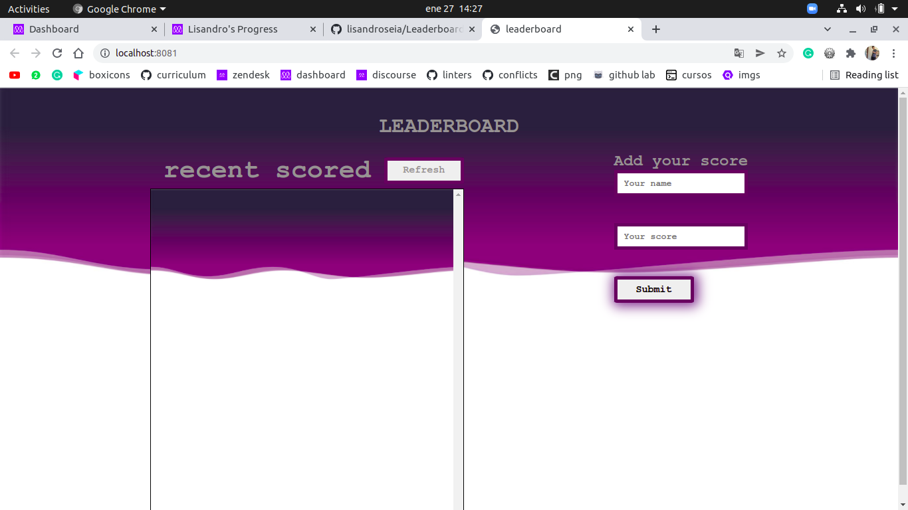

# Leaderboard

> In this project i made a functional leaderboard webpage, that works by adding and removing scores from an api

With  this project you can track all your scores

## Built With

- Html, css & JS
- Webpack
- Github
- Leaderboard API service

## Live Demo

[Live Demo Link](https://lisandroseia.github.io/Leaderboard/)

## Getting Started

To get a local copy up and running follow these simple example steps.

### Prerequisites
WebPack package installing

### Setup
Run https://github.com/lisandroseia/to-do-list.git to clon the repository

### Install
run **npm install**
run **npm run build**

### Usage
Run the comand **npm run start** to get a working environment with the project I made

## Authors

👤 **Lisandro Seia**

- GitHub: [@lisandroseia](https://github.com/lisandroseia)
- LinkedIn: [LinkedIn](https://www.linkedin.com/in/lisandro-seia-295120225/)

## 🤝 Contributing

Contributions, issues, and feature requests are welcome!

Feel free to check the [issues page](https://github.com/lisandroseia/Leaderboard/issues).

## Show your support

Give a ⭐️ if you like this project!

## 📝 License

This project is [MIT](./MIT.md) licensed.
